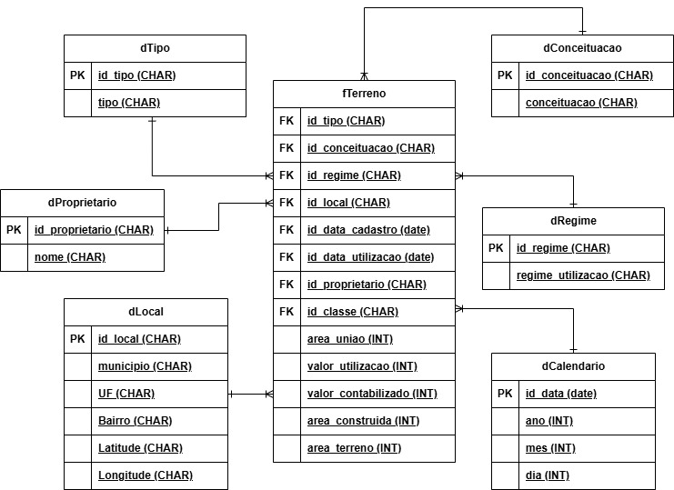
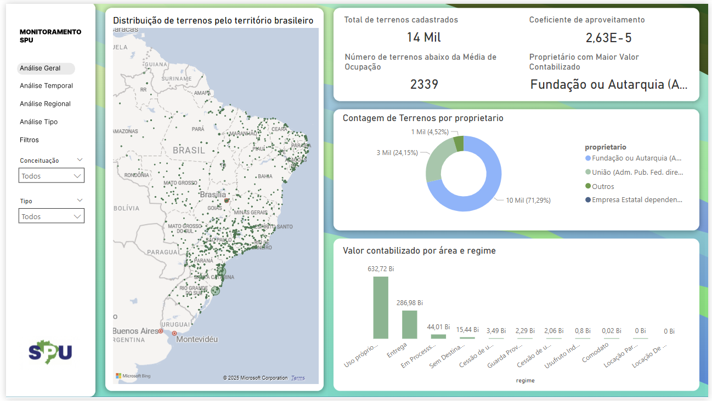
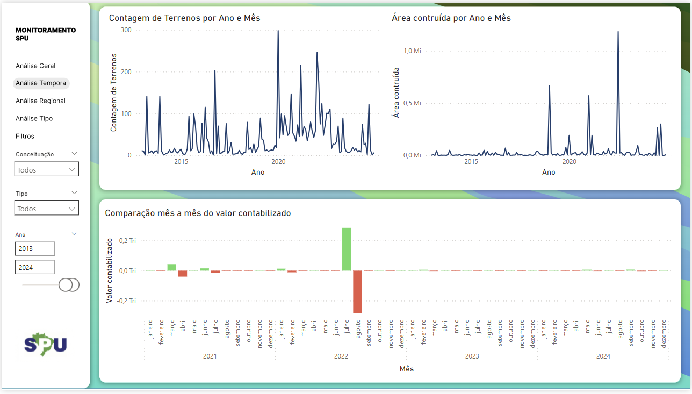
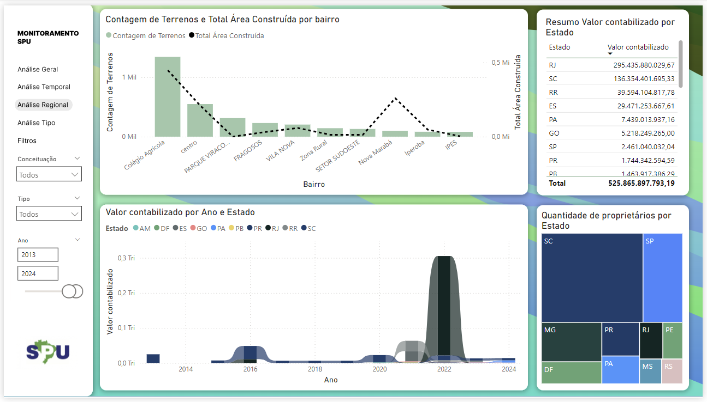
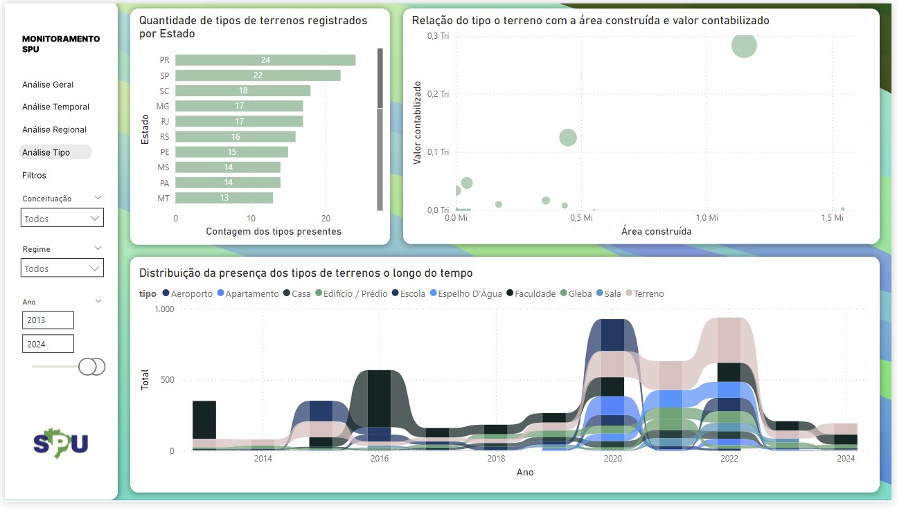

# Análise de Imóveis da União com Big Data e Power BI

Este projeto tem como objetivo analisar a base de dados da **Secretaria do Patrimônio da União (SPU)**, focando na gestão de imóveis públicos federais no Brasil. Utilizando técnicas de Big Data e ferramentas de visualização, o projeto busca oferecer insights que contribuam para uma gestão mais eficiente e sustentável desses bens.

## Objetivos

* Melhorar a gestão e o uso dos imóveis da União;
* Identificar oportunidades de retorno financeiro;
* Considerar aspectos sociais e regionais na análise;
* Promover o uso sustentável do patrimônio público.

## Dados Utilizados

* **Fonte:** [Imóveis da União - dados.gov.br](https://dados.gov.br/dataset/imoveis-da-uniao).
* **Formato:** CSV.

A base contém informações sobre localização, regime de ocupação, classificação do terreno, tipo, entre outras variáveis.

## Tecnologias Utilizadas

* Python (pandas, numpy)
* PostgreSQL (para armazernar os dados)
* Power BI
* Modelo dimensional (Data Warehouse)
* Jupyter Notebook

## Modelagem Dimensional

Foi adotado um **modelo estrela** com a tabela fato `fTerreno` e as seguintes dimensões:

* `dTipo`: tipo de terreno (residencial, comercial, etc.)
* `dConceituacao`: classificação geográfica e legal do terreno
* `dRegime`: forma de ocupação (locação, concessão, etc.)
* `dLocal`: localização (estado, município, latitude, longitude)
* `dProprietario`: entidade responsável pelo terreno
* `dCalendario`: dimensão temporal

## 🧹 Limpeza e Transformação dos Dados

### Tratamento de Valores Nulos

* Remoção de registros com valores essenciais ausentes
* Substituição de caracteres inválidos (como `'-'`) por `NaN`

### Remoção de Duplicatas

* Exclusão de registros duplicados nas tabelas dimensão

### Casting de Tipos

* Conversão de colunas para tipos adequados (ex: latitude/longitude para `float`)

Essas transformações foram essenciais para garantir qualidade e precisão nas análises posteriores.

## Visualização e Análise

A análise exploratória e visualização dos dados foram feitas com **Power BI**, permitindo observar padrões geográficos, regimes de ocupação predominantes e o perfil dos imóveis sob gestão da União.

## Análises realizadas

### Página Análise Geral
Na primeira página do relatório é possível avaliar um cenário geral das informações, com visão regional e dos proprietários.

- Qual região do país possui mais terrenos?
   - A região sul, sudeste e nordeste possuem os maiores índices de terrenos cadastrados, principalmente nos litorais.
- Total de terrenos cadastrados na base de dados e destes quantos estão abaixo da média de ocupação.
- Coeficiente de aproveitando: este indicador mede a relação entre a área construída e a área do terreno, indicando a quantidade máxima de metros quadrados que podem ser construídos. 
- Qual proprietário possui mais terrenos e o maior valor contabilizado?
   - Fundações e autarquias: autarquias são entidades públicas de direito público, criadas por lei para desempenhar funções típicas de Estado, como fiscalização ou previdência (ex.: INSS, IBAMA). As fundações públicas podem ser de direito público ou privado, criadas por lei e patrimônio inicial, para funções de interesse público, como pesquisa, cultura e saúde (ex.: FUNAI, Fiocruz).
   - Empresa estatal dependente possui pouca ou nenhuma participação nessa análise. Seu valor contabilizado não passa de 1 bilhão quando olhado para o valor contabilizado por área do terreno e regime.

### Página Análise Temporal

- Contagem de treinos cadastrados na base:
   - Houve um aumento nos terrenos nos anos entre 2020 e 2023 (anos de pandemia)
- Área construída:
   - Filtrando os tipos, é possível ver que o tipo Residência tem uma grande representatividade no pico de julho de 2022 (época em que a vacinação estava normalizando a situação?)
- Comparação mês a mês do valor contabilizado:
   - Avaliando mês a mês, com exceção da passagem de ano de 2022 para 2023, a maior parte está em vermelho, indicando uma diminuição no valor contabilizado dos terrenos. Isso sugere desvalorização ou compra de terrenos em locais mais distantes do centro e valorização.

### Página Análise Regional

- Contagem de Terrenos e Total Área Construída por bairro:
   - Colégio agrícola e zona rural: áreas rurais possuem mais registro de terrenos, mas a zona rural possui menor área construída (maior parte destinada ao plantio).
   - Nova Marabá: possui poucos terrenos, mas uma grande área construída. Provavelmente é um bairro novo na região ou possui muitas casas com grandes terrenos, indicando alto poder aquisitivo.
- Resumo Valor contabilizado por Estado:
   - Um ranqueamento dos estados com maior valor contabilizado.
- Resumo Valor contabilizado por Estado: indica onde as empresas estão investindo mais.
- Valor contabilizado por Ano e Estado: 
   - RJ teve um alto valor contabilizado no Tipo de terreno Base (espaços improvisados de vacinação da covid?).
   - SC apresenta uma consistência do valor contabilizado na universidade.

### Página Análise por Tipo de Terreno

- Quantidade de tipos de terrenos registrados por Estado:
   - O PR possui mais tipos de terrenos. Indicando investimentos diversos.
- Relação do tipo o terreno com a área construída e valor contabilizado:
   - O tipo Base possui maior valor contabilizado e também maior área construída. Em segundo lugar vem o  tipo Faculdade.
- Distribuição da presença dos tipos de terrenos o longo do tempo:
   - Em relação aos tipos Universidade, Faculdade e Terreno, é possível ver uma inversão no total de terrenos ao longo dos anos 2022-2024. Deles, Faculdade é o com maior valor contabilizado, mas menor em área construída. Os outros dois possuem uma espécie de progressão (não relacionada), Terreno tem menor área construída e valor contabilizado do que Universidade.

### Conclusão

A análise dos imóveis da União revelou uma forte concentração de terrenos nas regiões Sul, Sudeste e Nordeste, especialmente em áreas litorâneas. Zonas rurais apresentam muitos registros, mas com baixa ocupação, enquanto bairros urbanos como Nova Marabá se destacam pela alta densidade construída.

Foi possível observar um aumento nos registros durante os anos da pandemia (2020–2023), com destaque para terrenos do tipo Base, possivelmente usados em ações emergenciais. Autarquias e fundações públicas concentram a maior parte dos terrenos e do valor contabilizado, enquanto empresas estatais têm participação marginal.

Tipos como Base e Faculdade se destacam em valor, enquanto Universidade apresenta maior área construída em alguns estados, refletindo investimentos regionais. De forma geral, a análise reforça como o uso de dados públicos e ferramentas como Power BI podem contribuir para decisões mais estratégicas e sustentáveis na gestão do patrimônio público.

## Autor

**Felipe Lapa do Nascimento** ([LinkedIn](https://www.linkedin/felipelapadn.com) | [Email](mailto:felipelapadn@gmail.com)) 